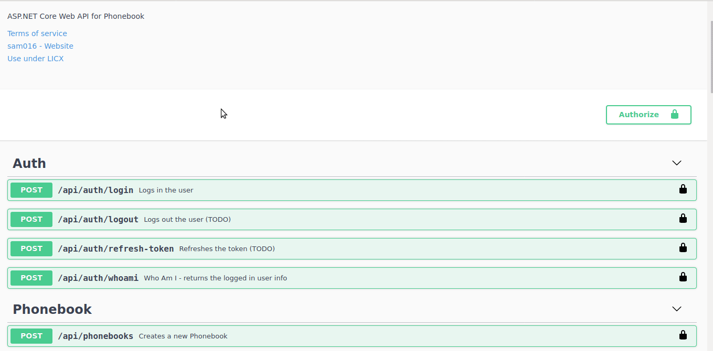

# Phonebook API

Built using
1. .NetCore 3.1
2. MySQL
3. MediatR
4. AutoMapper
5. JWT Auth
6. Swagger
7. Docker
8. Uses the concepts of DDD (Domain Driven Design) and SOLID

## Running the Container

```bash
docker-compose up
```

Above mentioned commands starts
- .NetCore API Service
-  MySQL DB (seeded by default from `db.sql`)

## Access APIs

### Access Swagger documentation for the APIs

Browse to http://localhost:5000/swagger

### Execute APIs

#### `/api/auth/login`

Login using `john@example.com` and `password`



#### `/api/auth/whoami`

Verify the logged in user details

Later, other endpoints can be used smoothly.

`/api/phonebooks` and `api/phonebooks/.../phone-entries` are protected and need authentication.

`/api/users` is open and doesn't need authentication

## Access Database

Browse to http://localhost:6001

    User: user
    Password: password

## TODO

1. Request Parameters Validation
2. Renew Token
3. Block Token (logout)
4. Pagination
5. Exception Handling
6. Logging
